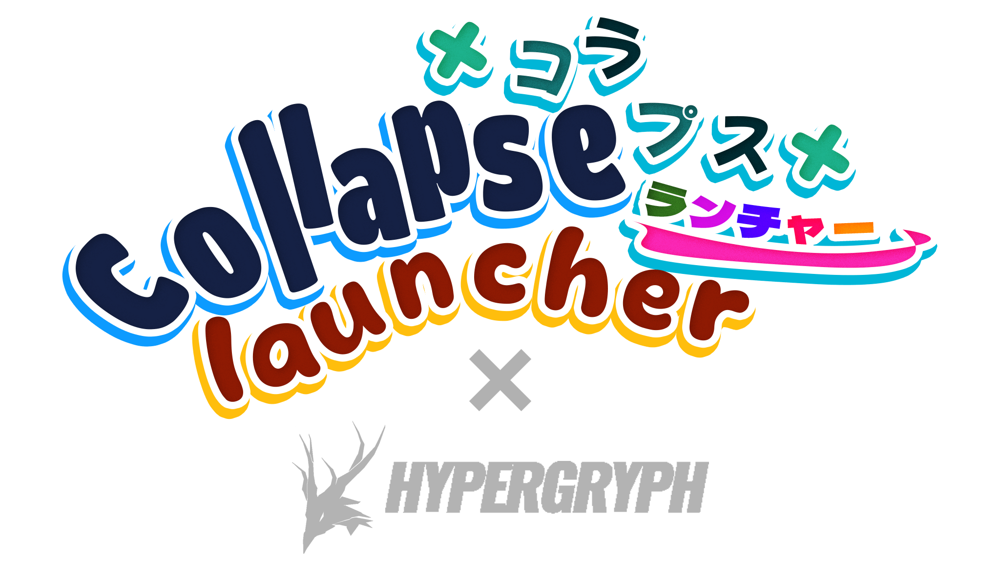

  

# Hi3Helper.Plugin.Endfield

**English** · [简体中文](./README.zh-CN.md)

A third-party plugin for [Collapse Launcher](https://collapselauncher.com/), designed to support the downloading,
updating, and launching of **Arknights: Endfield**.

The core functionality is currently ready for daily game management and launching.

  
  
  

---

> [!WARNING]
> **Important Notes & Limitations**
>
> Since there is no official plugin documentation for Collapse Launcher, this project is based on existing plugins, *
*and may have the following limitations**:
>
> 1. **Pre-download**: The official launcher has not yet enabled pre-download functionality, so the corresponding data
     structure is currently unknown.
> 2. **Integrity Check**: Game integrity checks will not be implemented for now (as this would require
     reverse-engineering the official launcher).
> 3. **Update Risk**: The game update function may have issues (currently untested).
     >    **It is highly recommended to backup your game directory before updating to prevent potential data loss.**

## ✨ Features

### ✅ Currently Supported

- **Version Detection**: Automatically checks if the game client is up to date.
- **Media Integration**: Fetches official background images, banners, and the latest news/announcements.
- **Game Management**: Supports full game download, installation, launching, and running process detection.
- **Server Support**:
    - [x] CN Server
    - [x] Global Server
    - [x] Bilibili Server

### 🚧 Roadmap / To-Do

- [ ] **Game Update**: To be tested and adapted once the official game version (1.0.14+) is released.
- [ ] **Pre-download Support**: Waiting for the official Launcher to implement the relevant interfaces.
- [ ] **Integrity Check**: Collapse Launcher does not currently provide the relevant API endpoints; waiting for upstream
  updates.
- [ ] **Social Media Panel**: Integration of official social media feeds. (Functionality is implemented, but temporarily
  disabled as icons cannot be retrieved via API).

---

## 🧩 Installation

**Prerequisites:**
Before using this plugin, please ensure your Collapse Launcher version is `1.83.14` or higher.

### Steps

1. **Download the Plugin**
   Go to the [Releases Page](https://github.com/misaka10843/Hi3Helper.Plugin.Endfield/releases/latest) and download the
   latest plugin archive (`.zip` file).

   

2. **Open Plugin Manager**
   Open the launcher, go to **Settings**, scroll down, and click on `Open Plugin Manager Menu`.

   

3. **Add and Restart**
   In the pop-up window, click the `Click to add .zip or manifest.json` button and select the `.zip` file you just
   downloaded.

   Once added, **restart the launcher** for the changes to take effect.

   

---

## ⚠️ Disclaimer

This project is a third-party open-source plugin and is not affiliated with *GRYPHLINE* or *Hypergryph*.